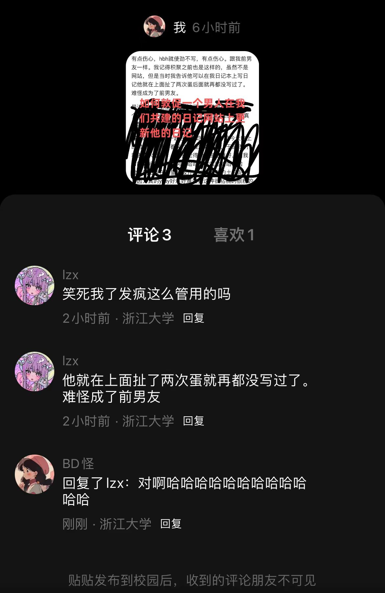

### *Note by cyx*

今天生日呜呜呜。

喜欢炳皓宝宝，昨天晚上他一直一直在说，说他一个背景图一直一直都插不进去，他插了一整个晚上，插得很疲惫，头晕头晕，我说我能帮忙吗，他说不能。我就一直玩着我那个刚刚成年的原神小号，然后等他，后面他说累了，他说就很不舒服，然后就蹲坑去了就说不想弄了难过。然后他就扔我一个网址，啊原来他是更新日记去了。我翻到29的那个md文件，发现他做了一个爱心。呜呜呜呜呜呜好开心。他那时候跟我说我弄出bug了，我一看，这哪里是bug呀这根本不是bug呀，好可爱的炳皓宝宝啊哈哈哈哈哈哈。而且他居然跟我说这是一个代码，他跟我说这个很简单的一小个代码而已哈哈哈哈哈哈。让一个不懂计算机的人写css码真的很神奇欸，他知不知道他自己不经意间触碰到了什么东西哈哈哈哈哈哈哈哈。也多亏了他我这才第一次好好接触了css码。（然后就发现css渲染很好玩而且不难！）

他一直很难过，因为他按照教程插了背景图但是插不进去。然后我今天早上也又看了一下，发现他查文件的时候路径插错了，他插成了绝对路径（但是啊啊啊啊啊啊他会自己插欸！）。然后我看到就改过来了，改成了相对路径。然后我把那个html文件扔浏览器里面试了一下，发现是可以正常有图片的（开心），但是网站上面就没有呈现出来，然后我想了想，我草，yml里面加的是md文件，我草不是html文件，那难怪不能有网页的效果！！！！！！！我终于找到问题所在了，还开心刚刚提交了一下，发现好了！

昨天拿手机看的日记，看到29号的那个新建网页，然后我就顺便翻了一翻28号，发现他28号也写了日记还写了好长好多！！哈哈哈哈那天他在写网站日记我在写手写日记欸，而且竟然是差不多时候！我日记本上第一句话就是现在距离29号还有9分钟。然后我心里一惊，我说我怎么今天才看到，，，然后我往前一翻，，，发现我20号的也没看到，，，，，，，，，，然后我就有点愧疚，因为是我没看到但我还骂他，，，，，，，，，，，，，我错了呜呜呜呜呜呜

但是，这是题外话/叉腰。啊哈哈哈哈哈哈哈哈哈哈。喜欢可爱的炳皓宝宝。

先写到这儿吧，蹲个坑去，写oop了要。

