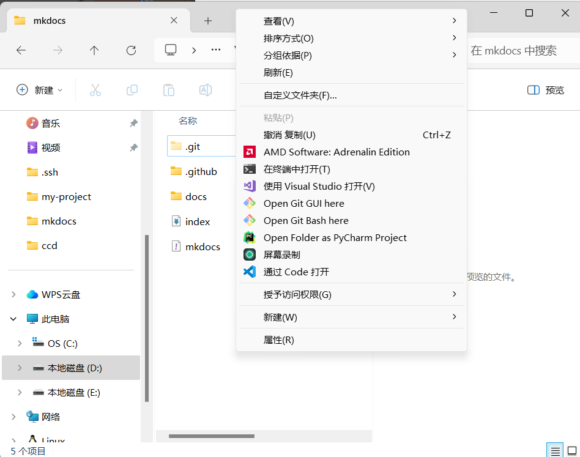
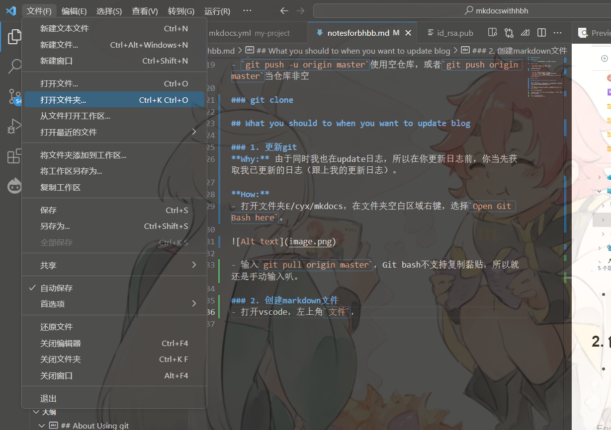
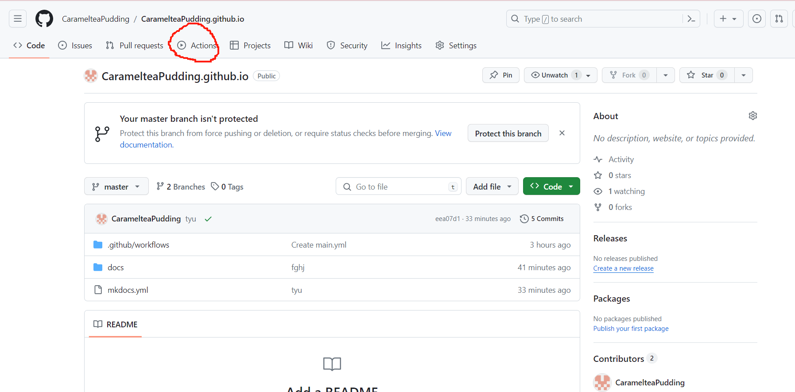
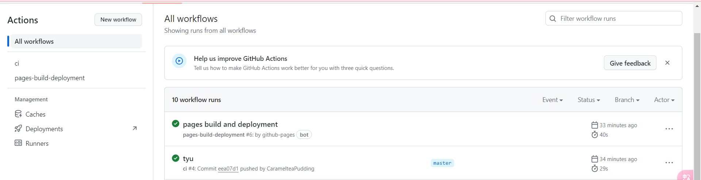
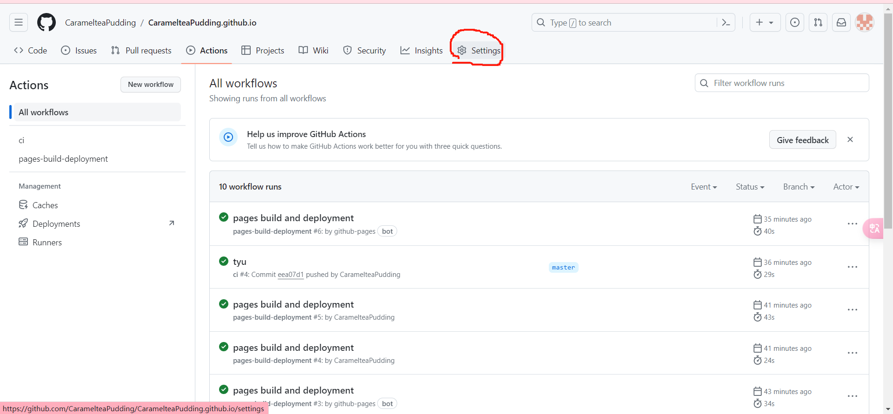
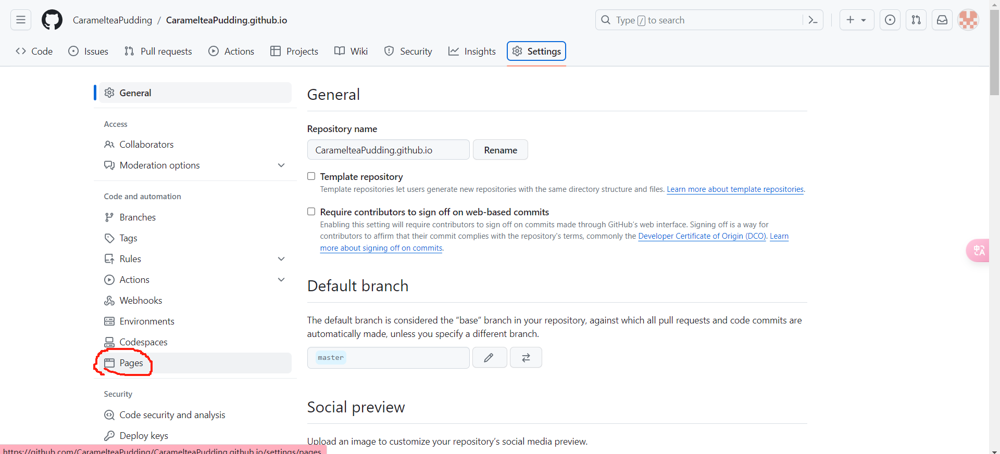
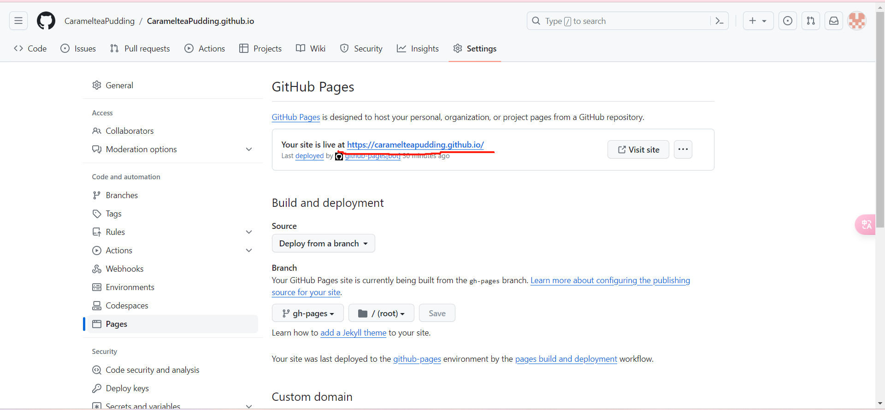

## About Using git

### git init

- `git init` 在新建文件夹下进行，使变成一个Git仓库

### git config

- `git config --global user.name "name"` 
- `git config --global user.email "email"`

同时还要注意ssh认证

### github update

- `git add .`将整个仓库内容上传至暂存区
- `git status` 可以看看你要上传的需要修改的是否正确
- `git commit -m "xxx"` 要跟上更新理由
- `git push -u origin master`使用空仓库，或者`git push origin master`当仓库非空

### git clone

## What you should to when you want to update blog

### 1. 更新git

**Why:** 由于同时我也在update日志，所以在你更新日志前，你当先获取我已更新的日志（跟上我的更新日志）。

**How:** 
- 打开文件夹E/cyx/mkdocs，在文件夹空白区域右键，选择`Open Git Bash here`。

- 输入`git pull origin master`，Git bash不支持复制黏贴，所以就还是手动输入叭。
- 完成后要注意，在mkdocs这个文件夹里面你会发现一个叫做`site`的文件夹，把它删掉。

### 2. 创建markdown文件

- 打开vscode，左上角`文件`，点击`打开文件夹`，选择E/cyx/mkdocs。
  
- 在docs文件夹中，对应月份文件夹下添加新markdown文件`xx.md`，进入文件编辑，可以点击右上角关闭键下一行`打开侧边预览`进行预览。
  
### 3. 修改yaml文件

- 打开E/cyx/mkdocs/mkdocs.yml（使用vscode打开）
- 下拉文件到最底部，找到`nav`板块中`BLOG`部分，按照之前的格式直接继续添加文件，添加格式为`xx(月)/xx(日): xx(yue)/xx(ri).md`，注意其中xx(ri).md是你在前一个步骤时候新建编写的文件。

### 4. git上传

- 在第一步的git bash中输入`git add .`(这一步如果没有报warning或者任何内容就是运行成功了)
- 输入`git commit -m "xx"`xx为你的上传理由(这一步只要出现多少files changed或者是create mode啥啥啥就是运行对了，没报error就继续)
- 输入`git push origin master`(如果最后一行有这样的字眼` master -> master`就是对了继续就好)

### 5. 网站update

- 打开github登录，点击右上角头像，在右侧边跳出弹窗，点击`Your profile`
- 点击选择进入仓库`CaramelteaPudding.github.io`
- 点击`Actions`

- 确认自己的更新已完成

如：这里`tyu`是我commit的时候的理由，tyu已完成（绿色的打钩）表示内容已完全上传，而`pages build and develoment`表示网页已重载完成。要完全等到网页重载好再进行下一步。

### 6. new website

- 如图点击settings

- 左侧点击pages

- 点击进入网站

*好啦，然后呢夸夸夸夸bhbb*